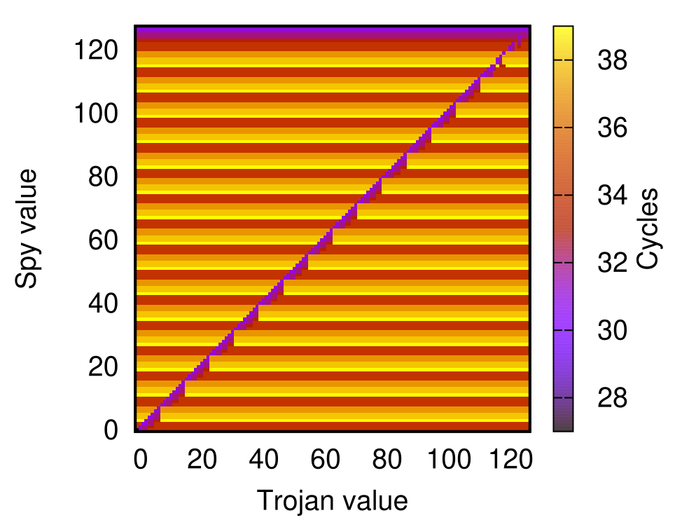

# TimeSecBench

**Alpha stage: not ready for production. Use it at your own risks.**

A benchmark suite to evaluate timing side-channels, built after [Embench](https://github.com/embench/embench-iot).

## Threat model

The benchmark suite evaluates microarchitectural timing leakages in a covert channels scenario.
The attacker controls a trojan and a spy applications. Her goal is to send information from the trojan to the spy by encoding it in the microarchitectural state.
Architectural timing leakages are out of scope: writing to memory or registers, measuring the trojan duration, etc.

## Benchmark list

The following benchmarks have been implemented.
- l1d: tests the L1 data cache.
- l1i: tests the L1 instruction cache.
- bht: tests the branch history table.
- btb: tests the branch target buffer.

## Usage

The usage is similar to the [Embench](https://github.com/embench/embench-iot) suite.
Details are provided in the [docs](./docs) folder:
 - How to add a new [chip](./docs/adding_new_chip.md)
 - How to add a new [board](./docs/adding_new_board.md)
 - How to add a new [benchmark](./docs/adding_new_benchmark.md)

